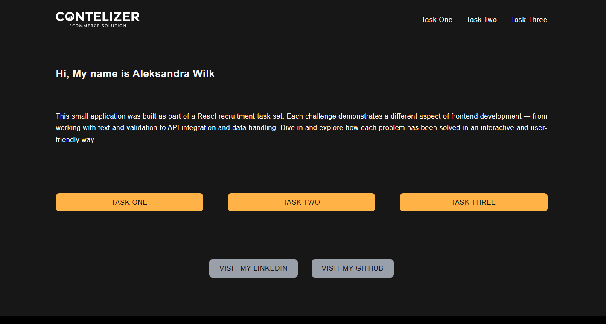

# 🧠 Contelizer v1.0.0  
**Frontend React Recruitment Project**

Contelizer is a small web application built as part of a React recruitment challenge.  
It demonstrates the ability to work with **React, TypeScript, SCSS, and data handling** through practical coding tasks.  
Each task showcases a different aspect of frontend development — from file parsing and validation to API integration and state management using React Query.

---
## 🦊 Live Demo  

🔗 **[Visit Contelizer on Vercel](https://contelizer-qbrj.vercel.app)**

[](https://contelizer-qbrj.vercel.app/)


## 🧩 Tasks Overview

### **Task One**
A text processing task.  
The user can upload a `.txt` file, and the app shuffles letters inside each word (keeping the first and last letter in place).  
The solution properly handles punctuation, uppercase/lowercase letters, multiline text, and Polish diacritics.

📁 **Key features:**
- File upload and preview  
- Shuffling algorithm  
- Proper handling of Polish characters  
- Option to download a sample `.txt` file  

---

### **Task Two**
A validation task (for example, PESEL or form validation).  
The task demonstrates clean, testable logic with clear UI feedback and error handling.

📁 **Key features:**
- Input validation logic  
- Error and success messages  
- Unit tests for validation  

---

### **Task Three**
An API integration task using the public API from **https://gorest.co.in/**.  
The app fetches a list of users and allows editing user details inside a form (mockup version currently without backend update).

📁 **Key features:**
- Fetching users with **React Query**  
- Editable user cards with a form  
- Controlled components and form states  
- Local mock update and console logging  

---

## 🐉 Screenshots

### 🏠 Home View  


### 🧩 Task One  


### ⚙️ Task Three  


---

## 🛠 Tech Stack


## :camel: Project structure
```
Contelizer
├── public
│ ├── favicon.svg
│ └── index.html
├── src
│ ├── components
│ ├── types
│ ├── utils
│ ├── views
│ │ ├── TaskOne
│ │ ├── TaskTwo
│ │ └── TaskThree
│ ├── App.tsx
│ ├── main.tsx
│ └── styles
├── package.json
├── tsconfig.json
└── vite.config.ts
```
## 🦄 Installation and Setup

**Clone the project:**
```
git clone https://github.com/OllaWilk/contelizer.git
```
**Go to the project directory:**
```
cd contelizer
```
**Install dependencies:**
```
npm install
```
**Start the server:**
```
npm run dev
```

🌱 What I Learned

This project helped me strengthen my understanding of React fundamentals and modern frontend architecture.
Through the process, I focused on building clean, reusable components and maintaining readable, consistent code.

Key lessons:

Structuring a project with separate views and UI components for scalability.

Managing server state effectively using React Query.

Handling user input, form validation, and controlled components.

Writing code that is easy to maintain and extend in future iterations.

Designing a consistent and minimal UI using SCSS modules.

Working on Contelizer also gave me a better sense of how to combine good UX, clean code, and clear logic into a complete and polished application.